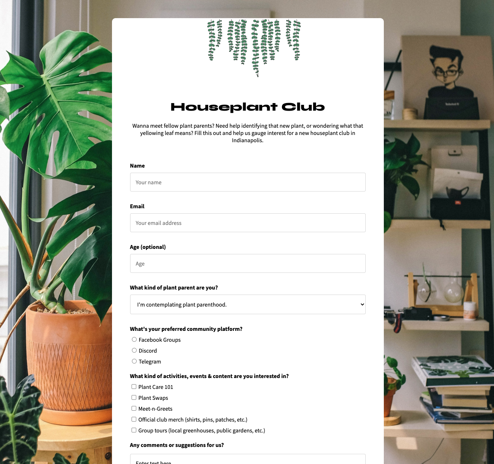

# Circle City Houseplant Club Survey

This survey form for gauging interest in a houseplant club was created to satisfy the requirements for the second project in freeCodeCamp's Responsive Web Design Certification. The goal of these project is to master basic HTML and CSS to create something accessible and responsive, while becoming familiar with HTML form elements.

